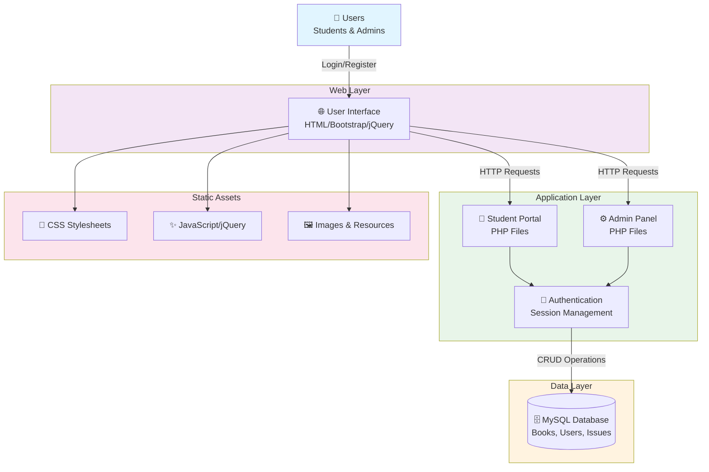

# 📚 Online Library Management System

<div align="center">


**A comprehensive web-based library management system built with PHP and MySQL**

[Features](#-features) • [Installation](#-installation) • [Usage](#-usage) • [Architecture](#-system-architecture) • [License](#-license)

</div>

---

## 📖 Overview

The **Online Library Management System** is a full-featured web application designed to simplify and streamline library operations. It provides separate interfaces for both students and administrators to manage books, track issues, and maintain comprehensive records.

Whether you're managing a school library, university library, or community resource center, this system offers an intuitive and efficient solution.

---

## ✨ Features

### 👤 Student Features
- 🔐 Secure user registration and authentication
- 📖 Browse and search available books
- 📤 Request and issue books
- 📋 View issued books and issue history
- 👁️ Check book availability in real-time
- 👤 Manage personal profile and credentials
- 🔑 Change password securely

### 🛡️ Admin Features
- 📚 Manage complete book catalog (add, edit, delete)
- ✍️ Manage authors and categories
- 👥 Register and manage students
- 📤 Issue and return books with tracking
- 📊 View comprehensive book issue history
- 📈 Monitor circulation statistics
- 🔑 Secure admin authentication

### 🎨 General Features
- **Responsive Design** - Works seamlessly on desktop and mobile devices
- **User-Friendly Interface** - Intuitive navigation and clear workflows
- **Data Validation** - Comprehensive input validation and error handling
- **Security** - Password encryption and SQL injection prevention
- **Database Integrity** - Proper relationships and constraints

---

## 🏗️ System Architecture



---

## 🚀 Getting Started

### System Requirements

- **Web Server**: Apache with PHP support (PHP 5.6 or higher)
- **Database**: MySQL 5.7 or higher
- **Browser**: Modern web browser (Chrome, Firefox, Safari, Edge)
- **Tools**: phpMyAdmin or MySQL CLI for database management

### 📥 Installation Steps

#### Step 1: Download & Extract
```bash
# Extract the project to your local system
# Copy the 'library' folder
```

#### Step 2: Setup Web Server
```bash
# Place the 'library' folder in your web server's root directory
# For Apache: htdocs folder (XAMPP/WAMP)
```

#### Step 3: Database Setup
1. Open **phpMyAdmin** in your browser
2. Create a new database named: `library`
3. Import the SQL file: `library.sql` (located in the project root)
4. Verify all tables are created successfully

#### Step 4: Access the Application
```
Student Portal:  http://localhost/library
Admin Panel:     http://localhost/library/admin
```

---

## 👨‍💼 Login Credentials

### Student Login
| Field | Credentials |
|-------|-------------|
| 📧 Email | `test@gmail.com` |
| 🔑 Password | `Test@123` |

### Admin Login
| Field | Credentials |
|-------|-------------|
| 👤 Username | `admin` |
| 🔑 Password | `Test@123` |

---

## 📂 Project Structure

```
library/
├── index.php                    # Student portal homepage
├── adminlogin.php              # Admin login page
├── signup.php                  # Student registration
├── dashboard.php               # Student dashboard
├── listed-books.php            # Browse books
├── issued-books.php            # View issued books
├── my-profile.php              # Profile management
├── change-password.php         # Password change
├── user-forgot-password.php    # Password recovery
├── check_availability.php      # Book availability check
├── logout.php                  # Session logout
│
├── admin/                      # Admin panel
│   ├── index.php               # Admin login
│   ├── dashboard.php           # Admin dashboard
│   ├── manage-books.php        # Book management
│   ├── manage-authors.php      # Author management
│   ├── manage-categories.php   # Category management
│   ├── issue-book.php          # Issue book functionality
│   ├── manage-issued-books.php # Track issued books
│   ├── reg-students.php        # Student registration
│   ├── student-history.php     # Student history
│   └── assets/                 # Admin assets
│
├── includes/                   # Shared PHP components
│   ├── config.php              # Database configuration
│   ├── header.php              # Page header
│   └── footer.php              # Page footer
│
└── assets/                     # Static files
    ├── css/                    # Stylesheets
    │   ├── bootstrap.css
    │   ├── font-awesome.css
    │   └── style.css
    ├── js/                     # JavaScript files
    │   ├── jquery-1.10.2.js
    │   ├── bootstrap.js
    │   ├── custom.js
    │   └── dataTables/         # Data table plugins
    └── img/                    # Images & icons
```

---

## 🔧 Configuration

### Database Configuration
Edit `includes/config.php` to set your database credentials:

```php
$host = "localhost";
$user = "root";
$password = "";
$database = "library";
```

---

## 🎯 Key Functionalities

| Feature | User Type | Details |
|---------|-----------|---------|
| **Book Search** | Student | Search books by title, author, or category |
| **Issue Request** | Student | Request books with availability check |
| **Issue History** | Student | Track all issued and returned books |
| **Profile Management** | Both | Update personal information |
| **Inventory Management** | Admin | Add, edit, delete books with details |
| **Circulation Tracking** | Admin | Monitor book issues and returns |
| **User Management** | Admin | Register and manage student accounts |

---

## 📋 Database Tables

The system includes the following main tables:
- **users** - Student and admin accounts
- **books** - Book inventory and details
- **authors** - Author information
- **categories** - Book categories
- **book_issues** - Issue and return history
- **book_request** - Book request tracking

---

## 🐛 Troubleshooting

| Issue | Solution |
|-------|----------|
| Database connection error | Check credentials in `config.php` |
| 404 - Page not found | Ensure 'library' folder is in web root |
| Login fails | Verify user exists in database |
| Images not loading | Check file permissions and image paths |

---

## 📝 License

This project is open source and available under the MIT License. Feel free to use, modify, and distribute as per the license terms.

---

## 📞 Support & References

For more information and detailed documentation, visit:
🔗 [Original Source](https://phpgurukul.com/online-library-management-system/)

---

<div align="center">

**Made with ❤️ for library management**

⭐ If you find this helpful, please consider starring the repository!

</div>
